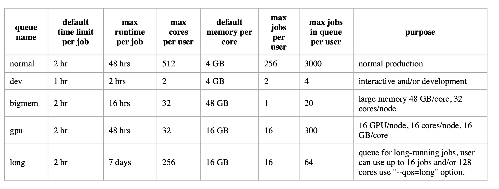

# Submitting slurm jobs

### 1) Getting started 

There are some great resources for using slurm, including a guide for the Sherlock cluster:

[https://www.sherlock.stanford.edu/docs/getting-started/submitting/](https://www.sherlock.stanford.edu/docs/getting-started/submitting/)

Here is a link to the FAS research computing guide:

[https://docs.rc.fas.harvard.edu/kb/convenient-slurm-commands/](https://docs.rc.fas.harvard.edu/kb/convenient-slurm-commands/)


### 2) The very basics

Example slurm script header for Sherlock:

```
#!/bin/bash
#SBATCH --job-name=short_queue_test_job
#SBATCH --time=00:01:00
#SBATCH --ntasks=1
#SBATCH --cpus-per-task=1
#SBATCH --mem=32000
#SBATCH --mail-user=youremail@stanford.edu
```

You will probably want to edit the following for each job:

name your job: ```--job-name```

give it a time limit: ```--time=hours:minutes:seconds```

memory and resources details, see Sherlock documents for more details: ```--cpus-per-task, mem
--ntasks,--mem```

To actually run this job, you need to generate a file with this header, followed by the job command you'd like to run. See the following example:

```cat /home/groups/schumer/example_slurm_short.sh```

To submit this example job, navigate to that directory and type:

```sbatch example_slurm_short.sh```

To check on the status of your job, type:

```squeue -u $USER```

To cancel your job, copy the job id that you see when checking the queue status and type:

```scancel [job id] ```

Remember to load modules you need to run your job inside the slurm script after the header. For example:

```module load biology

module load bwa

bwa index ref_genome.fa 
```


### 3) Partititions

You can run slurm jobs on a number of different sets of nodes, called partitions, on Sherlock. The partition you
choose to run your job on depends on how much time and memory you want to allocate to complete your job.
There are two kinds of slurm jobs: interactive and batch jobs.

* 3.1 Interactive jobs

You can work interactively on a compute node by launching a session with the partition sdev, by running:

```sdev```

This allocates a core with 4GB memory for one hour to you. If you want your session to last longer than an hour, you can specify the amount of time you want to keep the session open for (ex. 2 hr):

```sdev -t 2:00:00```

* 3.2 Batch jobs

**Batch jobs**

Below is a list of slurm partitions available to all Sherlock users for batch jobs:



There are 2 nodes with 1.5TB of RAM. Use these if your job needs more than 64 GB of RAM by adding

```#SBATCH --qos=bigmem --partition=bigmem' to your slurm script.```

There are three additional partitions available to our lab group:
hns - for all users in Humanities and Sciences
owners - for all users whose lab group has purchased compute nodes schumer - our personal compute nodes (see "Lab specific nodes" section)

A note about the "owners" partition:
This partition is the set of all lab group compute nodes. So when you run a job on "owners", your job is allocated to a currently free compute node from a different lab group. Lab groups get priority over their own nodes, so if they were to start a job on their node while your job is running on it, your job will be killed. If you choose to use this partition, be aware that this is a possibility, and be sure to monitor your slurm output for "JOB KILLED" error messages. However, this seems to be a fairly rare issue unless your job is exceedingly large.

To run your job on a specific partition, add the following to your slurm script:

```#SBATCH -p schumer```

Typically, it's helpful to specify several partitions, ranked in order of preference. The scheduler will send your job to the highest ranked partition with the available specified time and memory resources. This way, you don't have to wait until sufficient resources are available on a single partition.

```#SBATCH -p schumer,owners,hns,normal,schumer ```

###Lab specific nodes

We have 96 dedicated cores for the lab on Sherlock! To use these instead of the general queue simply add this line to your slurm script:

```#SBATCH -p schumer```

You can also compare how long it will take a job to start running on our lab nodes versus the normal queue:

```sbatch --test-only -p schumer myjob.sh```

```sbatch --test-only -p normal myjob.sh```

###Useful slurm commands

Cancel all of your jobs:

```scancel -u $USER```

Cancel all of you pending jobs:

```scancel -t PENDING -u $USER```

Cancel a job by job name:

```scancel --name [job name]```

for example:

```scancel --name bwa-mem```

There is also a script in Lab_shared_scripts that will take a list of slurm job ids or slurm stdout files and cancel those jobs. Usage is:

```perl /home/groups/schumer/shared_bin/Lab_shared_scripts/slurm_cancel_jobs_list.pl list_to_cancel```

For example, if you want to cancel a batch of submitted jobs which all start with 3161, you could do the following to generate your list of jobs to cancel:

```squeue -u $USER | grep 3161 | perl -pi -e 's/ +/\t/g' | cut -f 2 > list_to_cancel```

or if you'd like to stop all jobs that are currently running in a folder:

```ls slurm-*.out > list_to_cancel```

To submit a job to run after another job is done you can add a job (or multiple job) dependencies. For example, to submit after job id 39584578 has finished:

```sbatch --dependency=afterok:39584558 myjob.sh```

To submit after job 39584578 and 39584579 have finished:

```sbatch --dependency=afterok:39584558:39584579 myjob.sh```

